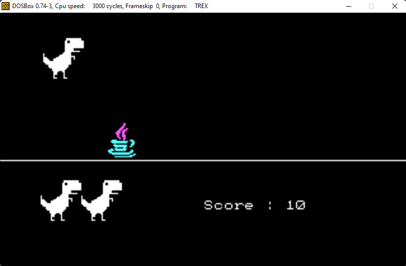

# TREX

My submission ( as outsider ) for the "TREX" RPI Game Jam.



## Info

Folders content :

- DIXIE : mini-library of functions to create multimedia programs in DOS

- SRC : main program sources 

- RES : reources folder

## Build and run
To start DOSBOX use 
```
rundosbox.bat
```

To build the project use :
```
CD TREX
BUILD.BAT
```

To run the project use :
```
TREX.EXE
```

## Note

The file __"trex.zip"__ contains a ready-to-run DOSBOX environment emulating a intel 386 with CGA card to run and/or modify the program with the included Turbo C.


